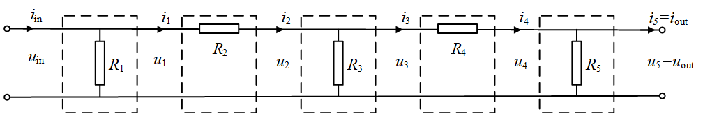

# **第06讲 矩阵的应用** `课后习题答案`

<font color="blue">作者：欧新宇（Xinyu OU）</font>

<font color="red">本文档所展示的测试结果，均运行于：Intel Core i7-7700K CPU 4.2GHz</font>

---

- ### **作业要求及提交**

1. 将所有运行结果保存为一个`word`文档（特别推荐保存为`pdf`文档进行提交）
2. 要求：使用编程环境完成下列习题，并按题目顺序进行排版，每个题目要求按如下顺序组织（若存在）:  
`0).`题目(将题目完整Copy到作业文档中，可以通过公式编辑器编辑或截图方式）；  
`1).`需要手工书写的部分，请尽量在word文档中进行编辑（迫不得已时，可书写在纸上并拍照）；  
`2).`代码（尽量通过从编程环境截图粘贴）；  
`3).`运行结果贴于文档中。 （复制运行结果到文档或通过截图粘贴）  
`x). ` **如果熟悉本编程环境'Jupyter Notebook'也可以直接在本环境中编写所有文稿及代码，并打印成pdf文档进行提交。**
3. 将文档上传至 `课堂派` 平台

> 注意：截图只需要截取必要部分。此外，请确保截图清晰可见。


-  ### **答案及解析**

**1. 给定矩阵$M=\begin{bmatrix}
1 & 0 & 0 & 0 \\
0 & 1 & 0 & 0 \\
0 & 0 & 1 & 0 \\
\end{bmatrix}$，分别求它的行空间形式和列空间形式。其中，向量组的系数以$a,b,c,d$进行表示。** 

**解：**

矩阵M的行空间形式为：$a(1,0,0,0)+b(0,1,0,0)+c(0,0,1,0)=(a,b,c,0)$

矩阵M的列空间形式为：$a\begin{bmatrix} 1 \\ 0 \\ 0 \end{bmatrix}
+b\begin{bmatrix} 0 \\ 1 \\ 0 \end{bmatrix}
+c\begin{bmatrix} 0 \\ 0 \\ 1 \end{bmatrix}
+d\begin{bmatrix} 0 \\ 0 \\ 0 \end{bmatrix}
=\begin{bmatrix} a \\ b \\ c \end{bmatrix}$

**2. 设存在矩阵
$A = \begin{bmatrix} 1 & 4 \\ 2 & 5 \\ 3 & 6 \end{bmatrix},
B = \begin{bmatrix} 1 & 4 & 7 \\ 2 & 5 & 8 \end{bmatrix}$, 向量
$u = \begin{bmatrix} 10 \\ 20 \end{bmatrix}, 
v = \begin{bmatrix} 100\\ 200 \\300 \end{bmatrix}$。
请将乘法$Au$和$Bv$分解成列的视角。**

**解：**

$Au=\begin{bmatrix} 1 & 4 \\ 2 & 5 \\ 3 & 6 \end{bmatrix} 
\begin{bmatrix} 10 \\ 20 \end{bmatrix}
=10\begin{bmatrix} 1 \\ 2 \\ 3 \end{bmatrix}
+20\begin{bmatrix} 4 \\ 5 \\ 6 \end{bmatrix}$

$Bv=\begin{bmatrix} 1 & 4 & 7 \\ 2 & 5 & 8 \end{bmatrix}
\begin{bmatrix} 100\\ 200 \\300 \end{bmatrix}
=100\begin{bmatrix} 1 \\ 2 \end{bmatrix}
+200\begin{bmatrix} 4 \\ 5 \end{bmatrix}
+300\begin{bmatrix} 7 \\ 8 \end{bmatrix}$

<br/>

**3. 【应用题】冠状病毒感染人员预测**

冠状病毒的感染是非常快速的，某城市有800万人，在1月15日有2000人确诊感染了冠状病毒。假设每天新增确诊病例为未感染人口的0.4%，每天的治愈率为确诊人群的5%。假设在没有找到有效的抑制病例增加手段和防感染疫苗的情况下，2天，10天，20天，50天，100天后分别有多少确诊病例。

**【进阶问题】** <font color="blue">按照当前的设定，多少天以后达到峰值，即：新增确诊病例和新增治愈人数基本一致。</font>

**【扩展问题】** <font color="red">有兴趣的同学可以考虑，如何利用Python获取，当治愈率上升到一定的程度，或感染率降低到一定的程度后，出现拐点的日期。</font>


**解**：我们可以用如下思路构建传染矩阵X。
1. 矩阵X的第一行第一个元素为一天后仍然没有被感染的人占前一天没有被感染人群的百分比; 第一行第二个元素为前一天被治愈的人群占前一天确诊感染人群的百分比。。
2. 矩阵A的第二行第一个元素为一天后被感染确诊的人占前一天没有被感染人群的百分比；第二行第二个元素为前一天确诊的同时没有被治愈的人占前一天确诊人群的百分比。

则有:
$A=\begin{bmatrix}
99.6/100 & 5/100 \\
0.4/100 & 95/100 \\
\end{bmatrix}$

若令 $x=\begin{bmatrix} 8000000-2000 \\ 2000 \end{bmatrix}$，则1天后确诊感染人数和正常人数可以用$A$乘以$x$计算。其中`(8000000-2000)*(99.6/100)`表示原来正常人群中仍然没有被感染的人数，`2000*(5/100)`表示一天后被治愈的人数，两者相加就是1天后正常人群的总数；`(8000000-2000)*(0.4/100)`表示新增确诊病例，`2000*(95/100)`表示一天后仍然没有被治愈的确诊人数，两者相加就是1天后处于确诊状态的被感染人群。

$Ax=\begin{bmatrix}
99.6/100 & 5/100 \\
0.4/100 & 95/100 \\
\end{bmatrix}
\begin{bmatrix} 
8000000-2000 \\
2000 \\
\end{bmatrix}
=\begin{bmatrix} 
0.996*7998000 + 0.05*2000 \\
0.004*7998000 + 0.95*2000 \\
\end{bmatrix}
=\begin{bmatrix} 
‭7,966,108‬ \\
‭33,892‬ \\
\end{bmatrix}$

一般地说，n天后，感染冠状病毒的人数和正常人数，可由$A^n x$求得。


```python
import numpy as np
A = np.array([[0.996, 0.05],[0.004,0.95]])
x = np.array([[7998000],[2000]])

n = [2, 10, 20, 50, 100] # n=1:A^2; n=2:A^3

person = x

for i in n:
    for j in range(i):
        person = np.dot(A, person)

    print("{:3d}天后，未感染人数为{:.0f}，确诊人数为{:.0f}".format(i, person[0][0], person[1][0]))

```

      2天后，未感染人数为7935938，确诊人数为64062
     10天后，未感染人数为7710784，确诊人数为289216
     20天后，未感染人数为7507362，确诊人数为492638
     50天后，未感染人数为7413636，确诊人数为586364
    100天后，未感染人数为7407432，确诊人数为592568
    

<br/>

**【进阶问题】** <font color="blue">按照当前的设定，多少天以后达到峰值，即：新增确诊病例和新增治愈人数基本一致。</font>
> 基本思路是设置一个`峰值`，当某一天确诊人数不再增长时，即确诊人数不高于峰值人数时，循环停止。

- 方法一：使用for循环


```python
import numpy as np
A = np.array([[0.996, 0.05],[0.004,0.95]])
x = np.array([[7998000],[2000]])

n = 999999 # n=1:A^2; n=2:A^3

person = x
top = 0

for i in range(n):
    person = np.dot(A, person)
    if top < person[1][0]:
        top = person[1][0]
#         print("\r {:3d}天后，未感染人数为{:.0f}，确诊人数为{:.0f}".format(i, person[0][0], person[1][0]), end="")
    else:
        print("\n 峰值出现在第{:3d}天，此时未感染人数为{:.0f}，确诊人数为{:.0f}".format(i, person[0][0], person[1][0]))
        break
```

    
     峰值出现在第613天，此时未感染人数为7407407，确诊人数为592593
    

- 方法二：使用while循环


```python
import numpy as np
A = np.array([[0.996, 0.05],[0.004,0.95]])
x = np.array([[7998000],[2000]])

person = x # 初始状态
top = person[1][0]
person = np.dot(A, person)
i = 0

while top < person[1][0]:    
    top = person[1][0]
    person = np.dot(A, person)
    i = i + 1

print("\n 峰值出现在第{:3d}天，此时未感染人数为{:.0f}，确诊人数为{:.0f}".format(i, person[0][0], person[1][0]))

```

    
     峰值出现在第613天，此时未感染人数为7407407，确诊人数为592593
    

<br/>

**4.【应用题】 网络的矩阵分割和连接**

给出如下电路图，同时已知输入电流$i_{in}=25A$和输入电压$u_{in}=220V$，假设并联电路的电阻$R_{并}=200$欧姆，串联电路的电阻$R_{串}=4$欧姆，求输出电流$i_{out}$和输出电压$u_{out}$。（输出结果保留2位小数）

> 在Python实现的时候，注意使用合理维度的数组存储数据。



解：观察以上电路图，不难得出结论，该电路图主要有2种不同的电路结构构成，分别是串联电路（第2,4组）和并联电路（第1,3,5组）。因此只需要分别求出这两种电路的传输矩阵，即可组件最终的五组电路构成的完整电路。

**(1). 求串联电路的传输矩阵(以第二组电路为例）**

1). 根据电路原理可以得到

$i_3 = i_2, u_3 = u_2 - i_2 R_2 $

2). 将公式转换为矩阵方程

$\begin{bmatrix} u_3 \\ i_3 \end{bmatrix}
=\begin{bmatrix} u_2 - i_2 R_2 \\ 0 - i_2 \end{bmatrix}
=\begin{bmatrix} 1 & -R_1 \\ 0 & 1 \end{bmatrix} \begin{bmatrix} u_2 \\ i_2 \end{bmatrix}
=A_{串} \begin{bmatrix} u_2 \\ i_2 \end{bmatrix}$

3). 获得第一个子网络的传输矩阵，即`单一串联电路`的传输矩阵。

$A_{串}=\begin{bmatrix} 1 & -R_{串} \\ 0 & 1 \end{bmatrix}
=\begin{bmatrix} 1 & -R_{串} \\ 0 & 1 \end{bmatrix}$

**(2). 求并联电路的传输矩阵(以第一组电路为例）**

1). 根据电路原理可以得到

$i_2 = i_1 - u_1/R_1, u_2 = u_1$

2). 将公式转换为矩阵方程

$\begin{bmatrix} u_2 \\ i_2 \end{bmatrix}
=\begin{bmatrix} u_1 + 0 i_1 \\ -u_1/R_1 + i_1 \end{bmatrix}
=\begin{bmatrix} 1 & 0 \\ -1/R_2 & 1 \end{bmatrix} \begin{bmatrix} u_1 \\ i_1 \end{bmatrix}
=A_{并} \begin{bmatrix} u_2 \\ i_2 \end{bmatrix}$

3). 获得第二个子网络的传输矩阵，即`单一并联电路`的传输矩阵。

$A_{并}=\begin{bmatrix} 1 & 0 \\ -1/R_2 & 1 \end{bmatrix}
\begin{bmatrix} 1 & 0 \\ -1/R_{并} & 1 \end{bmatrix}$

**(3). 求总电路的传输矩阵**

1). 联立5个组件电路获得最终的输出电压和电流

$\begin{bmatrix} u_{out} \\ i_{out} \end{bmatrix}
=A_5 A_4 A_3 A_2 A_1 \begin{bmatrix} u_1 \\ i_1 \end{bmatrix}
=A_{并} A_{串} A_{并} A_{串} A_{并} \begin{bmatrix} u_1 \\ i_1 \end{bmatrix}$

2). 使用Python求解最终结果

$A=A_2 A_1
=\begin{bmatrix} 1 & 0 \\ -1/R_2 & 1 \end{bmatrix} \begin{bmatrix} 1 & -R_1 \\ 0 & 1 \end{bmatrix}
=\begin{bmatrix} 1 & -R_1 \\ -1/R_2 & 1+R_1/R_2 \end{bmatrix}$

3). 利用传输矩阵求输出电压和输出电流

$\begin{bmatrix} u_3 \\ i_3 \end{bmatrix}
=A \begin{bmatrix} u_1 \\ i_1 \end{bmatrix}
=\begin{bmatrix} 1 & -R_1 \\ -1/R_2 & 1+R_1/R_2 \end{bmatrix} \begin{bmatrix} u_1 \\ i_1 \end{bmatrix}$

下面给出矩阵乘法$A=A_2 A_1$的Python描述。


```python
import numpy as np
from sympy import *

# 设 p表示并联电路 parallel connection, s表示并联电路 series connection

Rs = Symbol('Rs', real=True)   
Rp = Symbol('Rp', real=True)
u0 = Symbol('u0', real=True)
i0 = Symbol('i0', real=True)

IN = np.array([[u0], [i0]]) 

As = np.array([[1,-Rs],[0,1]])
Ap = np.array([[1,0],[-1/Rp,1]])
A = [Ap, As, Ap, As, Ap]

OUT = IN
for item in A:
    OUT = np.dot(item, OUT)


print('输出电压为: [{}] 伏特'.format(OUT[0][0]))
print('输出电流为: [{}] 安培'.format(OUT[1][0]))
```

    输出电压为: [-Rs*(i0 - u0/Rp) - Rs*(i0 - u0/Rp - (-Rs*(i0 - u0/Rp) + u0)/Rp) + u0] 伏特
    输出电流为: [i0 - u0/Rp - (-Rs*(i0 - u0/Rp) + u0)/Rp - (-Rs*(i0 - u0/Rp) - Rs*(i0 - u0/Rp - (-Rs*(i0 - u0/Rp) + u0)/Rp) + u0)/Rp] 安培
    


```python
import numpy as np
from sympy import *

# 设 p表示并联电路 parallel connection, s表示并联电路 series connection

Rs = 4     # Symbol('Rs', real=True)  
Rp = 200   # Symbol('Rp', real=True)
u0 = 220   # Symbol('u0', real=True)
i0 = 25    # Symbol('i0', real=True)

IN = np.array([[u0], [i0]]) 

As = np.array([[1,-Rs],[0,1]])
Ap = np.array([[1,0],[-1/Rp,1]])
A = [Ap, As, Ap, As, Ap]

OUT = IN
for item in A:
    OUT = np.dot(item, OUT)

print('输出电压为: {:.2f}V'.format(OUT[0][0]))
print('输出电流为: {:.2f}A'.format(OUT[1][0]))
```

    输出电压为: 31.29V
    输出电流为: 23.12A
    
